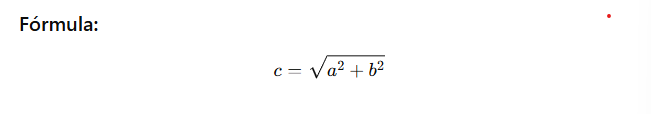

## 🧠 Teorema de Pitágoras em Python

O **Teorema de Pitágoras** afirma que:

> O quadrado da hipotenusa (o lado oposto ao ângulo reto) é igual à soma dos quadrados dos outros dois lados.

### 📐 Fórmula Matemática:



Podemos reescrever a raiz quadrada usando potência fracionária:

---

### 💻 Código em Python

```python
a = 3.0
b = 4.0
c = (a ** 2 + b ** 2) ** 0.5
print("c =", c)
